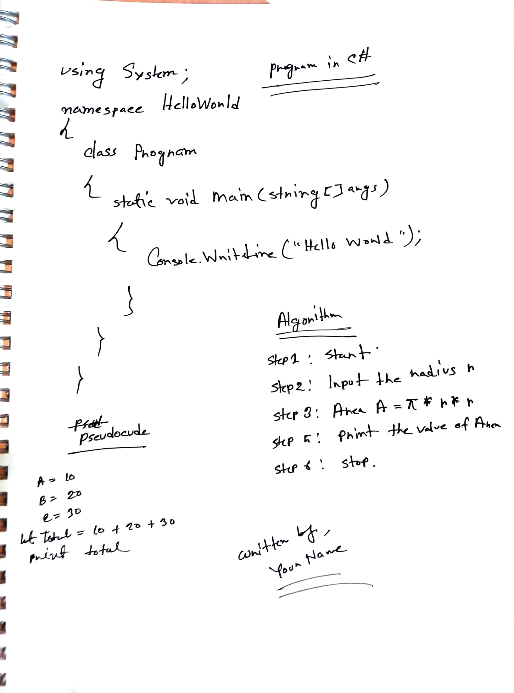

# HandwrittenComputerPrograms 👨‍💻🏆
A collection of handwritten program images.

# 🗃️ Upload Your Own Handwritten Computer Program / Contributing 🐞💼

If you're comfortable writing code, algorithm and pseudocude on paper, so you're a crazy programmer. If you have a handwritten program, scan it. Next, upload the image (Supported format's: ``.jpg``, ``jpeg`` etc.) to this `` uploads/img `` folder and Open a pull request.

> You can also change the styles and others files.🌟🌠🌠✨
