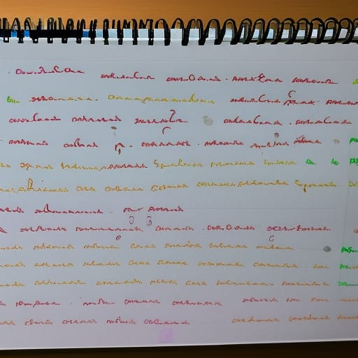

# HandwrittenComputerPrograms 👨‍💻🏆
A collection of handwritten program images.

# 🗃️ Upload Your Own Handwritten Computer Program / Contributing 🐞💼

If you're comfortable writing code, algorithm and pseudocude on paper, so you're a crazy programmer. If you have a handwritten program, capture a picture or scan it. Next, upload the image (Use this format : ``.jpg``, ``.jpeg``) to this `` uploads/img `` folder and Open a pull request.

> Read the <a href="CONTRIBUTE.md">CONTRIBUTE.md</a> to Contribute.🌟🌠🌠✨
